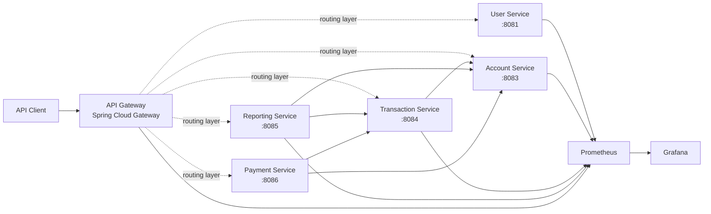

# FinBridge Platform

FinBridge is an **open-banking backend platform** built as a set of Java/Spring services. The project explores service decomposition, authentication, account and transaction workflows, inter-service communication, observability, API documentation, and local infrastructure for a banking-style domain.

> **Project status:** active development. The repository already contains working domain services and tests, while infrastructure and module wiring are being consolidated into a production-oriented setup.

## Engineering focus

- service-oriented backend architecture
- REST APIs with OpenAPI/Swagger documentation
- JWT-based authentication and Spring Security
- account balance and transaction workflows
- payment and reporting domains
- synchronous inter-service integration
- application metrics with Spring Boot Actuator and Micrometer
- Prometheus and Grafana monitoring stack
- Docker-based local infrastructure
- automated unit and integration tests

## Architecture



The gateway module is based on Spring Cloud Gateway. Service routing/configuration is currently being normalized as part of the infrastructure cleanup.

## Services

| Module | Responsibility | Current capabilities |
| --- | --- | --- |
| `user-service` | Identity and access | Registration, login, JWT authentication, authenticated profile endpoint |
| `account-service` | Bank accounts | Account creation, account lookup, balance lookup, debit and credit operations |
| `transaction-service` | Transactions | Transaction creation, account integration, transaction history by account |
| `payment-service` | Payments | Payment creation, lookup, listing, account payment history, payment status |
| `reporting-service` | Reporting and analytics | Generated report retrieval, account/transaction integration, scheduled reporting foundation |
| `gateway-service` | Edge routing | Spring Cloud Gateway / WebFlux module with health and observability dependencies |

## Technology stack

**Core**

- Java 21
- Spring Boot 3.x
- Spring Cloud
- Maven

**Backend**

- Spring Web / WebFlux
- Spring Data JPA
- Spring Security
- Spring Validation
- OpenFeign
- Resilience4j
- JWT (`jjwt`)

**API & documentation**

- REST
- Springdoc OpenAPI
- Swagger UI

**Data & infrastructure**

- H2 for current service-level development persistence
- PostgreSQL and Redis local infrastructure definitions
- Docker Compose

**Observability**

- Spring Boot Actuator
- Micrometer
- Prometheus
- Grafana

**Testing**

- Spring Boot Test
- Spring Security Test
- service-level unit and integration tests

## Implemented API examples

### Users

```http
POST /api/v1/users/register
POST /api/v1/users/login
GET  /api/v1/users/profile
GET  /api/v1/users/health
```

### Accounts

```http
POST /api/v1/accounts
GET  /api/v1/accounts/user/{userId}
GET  /api/v1/accounts/{id}
GET  /api/v1/accounts/{id}/balance
POST /api/v1/accounts/{id}/debit
POST /api/v1/accounts/{id}/credit
```

### Transactions

```http
POST /api/v1/transactions
GET  /api/v1/transactions/account/{accountId}
```

### Payments

```http
POST /api/v1/payments
GET  /api/v1/payments
GET  /api/v1/payments/{id}
GET  /api/v1/payments/account/{accountId}
GET  /api/v1/payments/{id}/status
```

### Reports

```http
GET /api/v1/reports/{date}?format=csv
```

## Observability

Several services expose Spring Boot Actuator metrics and Prometheus endpoints. The repository includes a monitoring stack under `monitoring/` with Prometheus scrape configuration and Grafana infrastructure.

Current Prometheus targets include the user, account, transaction, reporting and gateway services.

## Local development

### Prerequisites

- JDK 21
- Maven 3.9+
- Docker / Docker Compose for local infrastructure and monitoring

Services can be started independently while the root build and infrastructure definitions are being consolidated.

Examples:

```bash
mvn -f user-service/pom.xml spring-boot:run
mvn -f account-service/pom.xml spring-boot:run
mvn -f transaction-service/pom.xml spring-boot:run
mvn -f reporting-service/pom.xml spring-boot:run
mvn -f payment-service/pom.xml spring-boot:run
```

Swagger UI is configured in the REST services and is available on each service's configured port when that service is running.

## Repository structure

```text
finbridge-platform/
├── gateway-service/
├── user-service/
├── account-service/
├── transaction-service/
├── payment-service/
├── reporting-service/
├── monitoring/
│   ├── prometheus/
│   └── grafana/
├── docker/
├── docker-compose.yml
└── pom.xml
```

## Current engineering roadmap

The next iterations focus on turning the current development environment into a consistent production-style platform:

- [ ] consolidate all services into one Maven reactor build
- [ ] finish API Gateway routing configuration
- [ ] migrate service persistence from development H2 databases to PostgreSQL
- [ ] move credentials and JWT secrets to environment-based configuration
- [ ] normalize Docker Compose files and containerize application services
- [ ] connect Redis to concrete platform use cases
- [ ] harden inter-service error handling and resilience policies
- [ ] add unified CI pipeline for build and tests
- [ ] expand integration and contract testing
- [ ] provision Grafana dashboards and alerting
- [ ] introduce distributed tracing and structured logging
- [ ] prepare Kubernetes/Helm deployment as the infrastructure track evolves

## Why this project exists

FinBridge is used as an engineering sandbox for building and evolving a non-trivial backend system: domain decomposition, service communication, security, data consistency, observability, testing, and deployment practices can be developed together rather than as isolated tutorial examples.

## License

See [`LICENSE`](LICENSE).
