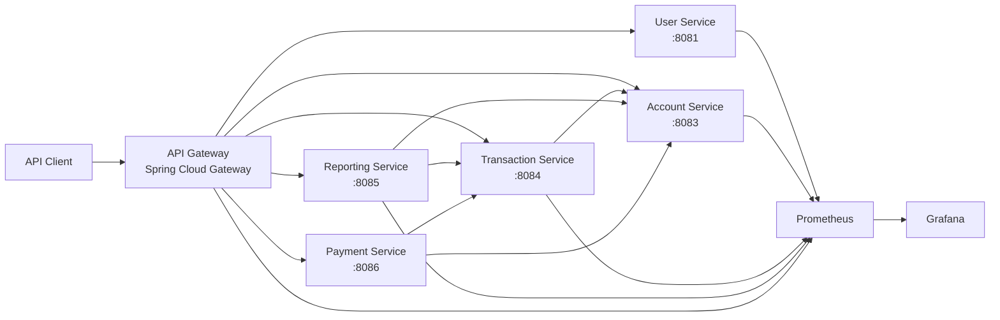

# FinBridge Platform

[](https://github.com/romusio/finbridge-platform/actions/workflows/ci.yml)

FinBridge is an **open-banking backend platform** built as a set of Java/Spring services. It is an engineering project for developing production-oriented backend practices around service decomposition, authentication, financial workflows, inter-service communication, observability, automated testing, and infrastructure.

> **Status:** active development. The backend is organized as a single Maven reactor, verified by GitHub Actions on Java 21, with environment-based secret configuration and a Prometheus/Grafana observability stack.

## Engineering focus

- service-oriented backend architecture
- REST APIs with OpenAPI / Swagger documentation
- JWT authentication and Spring Security
- account balance, transaction, payment, and reporting workflows
- synchronous inter-service communication with OpenFeign
- resilience patterns with Resilience4j
- Spring Boot Actuator and Micrometer metrics
- Prometheus and Grafana monitoring
- Docker Compose local infrastructure
- automated unit and integration verification in CI

## Architecture



The gateway exposes explicit routes to the platform services. Service-level persistence is currently based primarily on H2 for development and test isolation; PostgreSQL and Redis are already represented in the local infrastructure and are part of the next runtime evolution.

## Services

| Module | Responsibility | Implemented capabilities |
| --- | --- | --- |
| `gateway-service` | Edge routing | Spring Cloud Gateway routes, health checks, Actuator and Prometheus integration |
| `user-service` | Identity and access | Registration, login, JWT authentication, authenticated profile endpoint |
| `account-service` | Bank accounts | Account creation and lookup, balance queries, debit and credit operations |
| `transaction-service` | Transactions | Transaction creation, account-service integration, transaction history |
| `payment-service` | Payments | Payment creation and lookup, account payment history, payment status |
| `reporting-service` | Reporting and analytics | Report retrieval, account/transaction integrations, scheduled reporting foundation |

## Technology stack

### Core

- Java 21
- Spring Boot 3.2.9
- Spring Cloud 2023.0.3
- Maven multi-module reactor

### Backend

- Spring Web / WebFlux
- Spring Data JPA
- Spring Security
- Spring Validation
- Spring Cloud OpenFeign
- Resilience4j
- JWT (`jjwt`)

### API & documentation

- REST
- Springdoc OpenAPI
- Swagger UI

### Data & infrastructure

- H2 for current service-level development and tests
- PostgreSQL local infrastructure
- Redis local infrastructure
- Docker Compose
- environment-based configuration through `.env`

### Observability

- Spring Boot Actuator
- Micrometer
- Prometheus
- Grafana

### Quality & delivery

- JUnit / Spring Boot Test
- integration tests
- GitHub Actions
- full reactor verification with `mvn clean verify`

## CI

Every pull request to `main` is verified on Java 21 by GitHub Actions.

```text
Checkout
   ↓
Set up Java 21
   ↓
Maven reactor
   ↓
Compile all services
   ↓
Run unit & integration tests
   ↓
Package services
```

Run the same verification locally:

```bash
mvn clean verify
```

## Implemented API examples

### Users

```http
POST /api/v1/users/register
POST /api/v1/users/login
GET  /api/v1/users/profile
GET  /api/v1/users/health
```

### Accounts

```http
POST /api/v1/accounts
GET  /api/v1/accounts/user/{userId}
GET  /api/v1/accounts/{id}
GET  /api/v1/accounts/{id}/balance
POST /api/v1/accounts/{id}/debit
POST /api/v1/accounts/{id}/credit
```

### Transactions

```http
POST /api/v1/transactions
GET  /api/v1/transactions/account/{accountId}
```

### Payments

```http
POST /api/v1/payments
GET  /api/v1/payments
GET  /api/v1/payments/{id}
GET  /api/v1/payments/account/{accountId}
GET  /api/v1/payments/{id}/status
```

### Reports

```http
GET /api/v1/reports/{date}?format=csv
```

## Observability

The services expose Spring Boot Actuator endpoints, with Micrometer metrics available for Prometheus scraping where configured.

The repository includes:

```text
monitoring/
├── prometheus/
│   └── prometheus.yml
└── grafana/
```

Prometheus currently includes targets for the user, account, transaction, reporting, and gateway services. Grafana runs on top of the collected Prometheus data.

## Local development

### Prerequisites

- JDK 21
- Maven 3.9+
- Docker / Docker Compose

### 1. Configure local environment

```bash
cp .env.example .env
```

Replace the example values with local credentials and a sufficiently long random JWT secret. The real `.env` file is ignored by Git and must not be committed.

### 2. Verify the complete backend

```bash
mvn clean verify
```

### 3. Start local infrastructure

```bash
docker compose up -d
```

This provisions the PostgreSQL and Redis development infrastructure.

### 4. Start services

Services can be launched through Maven, for example:

```bash
mvn -pl user-service spring-boot:run
mvn -pl account-service spring-boot:run
mvn -pl transaction-service spring-boot:run
```

Other modules can be started in the same way with `-pl <module>`.

### 5. Start observability stack

After the shared FinBridge Docker network exists:

```bash
docker compose -f monitoring/docker-compose.monitoring.yml up -d
```

Prometheus is exposed on port `9090` and Grafana on port `3000` by the current local configuration.

## Repository structure

```text
finbridge-platform/
├── .github/
│   └── workflows/
│       └── ci.yml
├── gateway-service/
├── user-service/
├── account-service/
├── transaction-service/
├── payment-service/
├── reporting-service/
├── monitoring/
│   ├── prometheus/
│   └── grafana/
├── docker/
├── docker-compose.yml
├── .env.example
└── pom.xml
```

## Engineering progress

Completed foundation work:

- [x] consolidate all backend services into one Maven reactor
- [x] configure API Gateway routing
- [x] remove secrets and local credentials from tracked runtime configuration
- [x] normalize Docker Compose configuration
- [x] remove IDE/build artifacts from version control
- [x] add GitHub Actions build and test verification
- [x] repair service-boundary integration testing for the transaction workflow

Next iterations:

- [ ] introduce PostgreSQL runtime profiles while preserving isolated test persistence
- [ ] containerize the application services themselves
- [ ] connect Redis to concrete platform use cases
- [ ] harden inter-service error handling and resilience policies
- [ ] expand service-level, integration, and contract test coverage
- [ ] provision versioned Grafana dashboards and alerting
- [ ] introduce structured logging and distributed tracing
- [ ] add container build/publish stages to CI/CD
- [ ] prepare Kubernetes and Helm deployment as the infrastructure track evolves

## Why this project exists

FinBridge is intentionally broader than a CRUD demo. It provides one codebase in which backend design, distributed-service boundaries, security, testing, observability, CI/CD, and infrastructure can evolve together and be evaluated through concrete engineering decisions.

## License

See [`LICENSE`](LICENSE).
